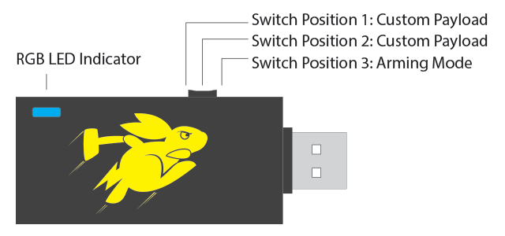
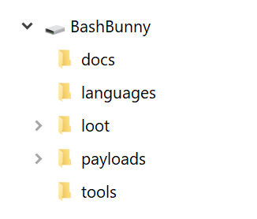
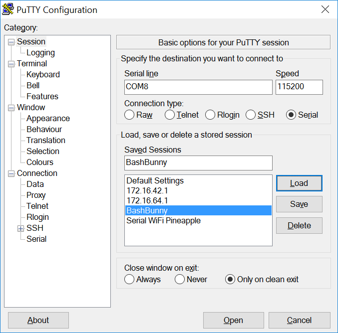

# Bash Bunny Essentials

The Bash Bunny by Hak5 is the world’s most advanced USB attack platform. It delivers penetration testing attacks and IT automation tasks in seconds by emulating combinations of trusted USB devices – like gigabit Ethernet, serial, flash storage and keyboards. With it, computers are tricked into divulging data, exfiltrating documents, installing backdoors and many more exploits.

## Contributing to the Wiki

### Thank You
The Bash Bunny Wiki is brought to you by Hak5 and many other community members. As a community driven resource, the people who use and edit the wiki would be very grateful if you followed the guidelines below. 

All changes to the wiki can be contributed on [GitHub](https://github.com/hak5/bashbunny-wiki)

### Markdown
Markdown Basics: https://help.github.com/articles/markdown-basics/

Markdown Syntax: http://daringfireball.net/projects/markdown/syntax

Table Generator: http://www.tablesgenerator.com/markdown_tables


## Switch Positions

In Switch Position 3 (closest to the USB plug) the Bash Bunny will boot into _arming mode_, enabling both Serial and Mass Stoage. From this dedicated mode, Bash Bunny payloads may be managed via Mass Storage and the Linux shell can be accessed by the Serial console.



## Mass Storage Directory Structure



* The _library_ folder is home to the payloads library which can be downloaded from the [Bash Bunny Payload git repository](https://github.com/hak5/bashbunny-payloads "Bash Bunny Payload git repository")
* The _switch1_ and _switch2_ folders are home to payload.txt and accompanying files which will be executed on boot when the bash bunny switch is in the corresponding position.
* The _loot_ folder is used by many payloads to save logs and other captured information.

## Default Settings

* Username: root
* Password: hak5bunny
* IP Address: 172.16.64.1
* DHCP Range: 172.16.64.10-12

### LED Status

| LED                  | Status                                            |
| -------------------- | ------------------------------------------------- |
| Green (blinking)     | Booting up                                        |
| Blue (blinking)      | Arming Mode                                       |
| Red (blinking)       | Recovery Mode **DO NOT UNPLUG**                   |
| Red/Blue Alternating | Recovery Mode from v1.1 onwards **DO NOT UNPLUG** |

---

# Bash Bunny Payloads

Bash Bunny payloads can be written in any standard text editor, such as notepad, vi or nano. 

Payloads must be named payload.txt. When the Bash Bunny boots with its switch in position 1 or 2, the payload.txt file from the corresponding switch folder is executed. 

Payloads can be swapped by copy/paste when the Bash Bunny is in its arming mode (switch position 3 - closest to the USB plug) via Mass Storage.

## Bunny Script

Bunny Script is a language consisting of a number of simple commands specific to the Bash Bunny hardware, some bunny helper functions and the full power of the Bash Unix shell and command language. Theses payloads, named payload.txt, execute on boot by the Bash Bunny.

The _Bunny Helpers_ can be sourced which extend the bunny scripting language with user contributed functions and variables which enhance and simplify payloads. All Bunny Script commands are written in ALL CAPS. The base Bunny Script commands are:

| COMMAND    | Description                                                           |
| ---------- | --------------------------------------------------------------------- |
| ATTACKMODE | Specifies the USB device or combination of devices to emulate.        |
| LED        | Control the RGB LED. Accepts color and pattern or payload state.      |
| QUACK      | Injects keystrokes (ducky script) or specified ducky script file.     |
| Q          | Alias for QUACK                                                       |
| DUCKY_LANG | Set the HID Kayboard language. *e.g: DUCKY_LANG us*                   |

### Extensions

Extensions which augment the bunny scripting language with new commands and functions. For each payload.txt run, extensions are sourced automatically. Calling the function names of any extension will produce the desired result. Extensions reside in the payload library on the USB mass storage partition from /payloads/library/extensions.

#### Example Extensions

This table is provides a non-exhaustive list of basic usage for some extensions. Additional extension documentation can be found from the comments within each individual extension script file in /payload/library/extensions.

| COMMAND          | Description                                                  | Example                                        |
| ---------------- | ------------------------------------------------------------ | ---------------------------------------------- |
| RUN              | Keystroke injection shortcut for mutli-OS command execution. | RUN WIN notepad.exe                            |
|                  |                                                              | RUN OSX terminal                               |
|                  |                                                              | RUN UNITY xterm                                |
| GET              | Exports system variables                                     | GET TARGET_IP # exports $TARGET_IP             |
|                  |                                                              | GET TARGET_HOSTNAME # exports $TARGET_HOSTNAME |
|                  |                                                              | GET HOST_IP # exports $HOST_IP                 |
|                  |                                                              | GET SWITCH_POSITION # exports $SWITCH_POSITION |
| REQUIRETOOL      | Exits payload with LED FAIL state if the specified tool is not found in /tools | REQUIRETOOL impacket         |
| DUCKY_LANG       | Accepts two letter country code to set the HID injection language for subsequent ducky script / QUACK commands | DUCKY_LANG us |

**NOTE**: Extensions replaced bunny_helpers.sh from [Bash Bunny firmware version 1.1}(https://www.bashbunny.com/downloads/) onwards.

### ATTACKMODE

ATTACKMODE is a bunny script command which specifies which devices to emulate. The ATTACKMODE command may be issued multiple times within a given payload. For example, a payload may begin by emulating Ethernet, then switch to emulating a keyboard and serial later based on a number of conditions. 

| ATTACKMODE         | Type                                   | Description                                                |
| ------------------ | -------------------------------------- | ---------------------------------------------------------- |
| SERIAL             | ACM - Abstract Control Model           | Serial Console                                             |
| ECM_ETHERNET       | ECM - Ethernet Control Model           | Linux/Mac/Android Ethernet Adapter                         |
| RNDIS_ETHERNET     | RNDIS - Remote Network Drv Int Spec    | Windows (and some Linux) Ethernet Adapter                  |
| STORAGE            | UMS - USB Mass Storage                 | Flash Drive                                                |
| HID                | HID - Human Interface Device           | Keyboard - Keystroke Injection via Ducky Script            |

Many combinations of attack modes are possible, however some are not. For exmaple, ATTACKMODE HID STORAGE ECM_ETHERNET is valid while ATTACKMODE RNDIS_ETHERNET ECM_ETHERNET STORAGE SERIAL is not. Each attack mode combination registers using a different USB VID/PID (Vendor ID/Product ID) by default. VID and PID can be spoofed using the VID and PID commands.

| ATTACKMODE COMBINATION        | VID / PID     |
| ----------------------------- | ------------- |
| SERIAL STORAGE                | 0xF000/0xFFF0 |
| HID                           | 0xF000/0xFF01 |
| STORAGE                       | 0xF000/0xFF10 |
| SERIAL                        | 0xF000/0xFF11 |
| RNDIS_ETHERNET                | 0xF000/0xFF12 |
| ECM_ETHERNET                  | 0xF000/0xFF13 |
| HID SERIAL                    | 0xF000/0xFF14 |
| HID STORAGE                   | 0xF000/0xFF02 |
| HID RNDIS_ETHERNET            | 0xF000/0xFF03 |
| HID ECM_ETHERNET              | 0xF000/0xFF04 |
| HID STORAGE RNDIS_ETHERNET    | 0xF000/0xFF05 |
| HID STORAGE ECM_ETHERNET      | 0xF000/0xFF06 |
| SERIAL RNDIS_ETHERNET         | 0xF000/0xFF07 |
| SERIAL ECM_ETHERNET           | 0xF000/0xFF08 |
| STORAGE RNDIS_ETHERNET        | 0xF000/0xFF20 |
| STORAGE ECM_ETHERNET          | 0xF000/0xFF21 |

### LED

The multi-color RGB LED status indicator on the Bash Bunny may be set using the LED command. It accepts either a combination of color and pattern, or a common payload state. 

#### LED Colors

| COMMAND | Description                    | 
| ------- | ------------------------------ |
| R       | Red                            |
| G       | Green                          |
| B       | Blue                           |
| Y       | Yellow (AKA as Amber)          |
| C       | Cyan (AKA Light Blue)          |
| M       | Magenta (AKA Violet or Purple) |
| W       | White                          |

#### LED Patterns

| PATTERN    | Description                                              |
| ---------- | -------------------------------------------------------- |
| SOLID      | *Default* No blink. Used if pattern argument is ommitted |
| SLOW       | Symmetric 1000ms ON, 1000ms OFF, repeating               |
| FAST       | Symmetric 100ms ON, 100ms OFF, repeating                 |
| VERYFAST   | Symmetric 10ms ON, 10ms OFF, repeating                   |
| SINGLE     | 1 100ms blink(s) ON followed by 1 second OFF, repeating  |
| DOUBLE     | 2 100ms blink(s) ON followed by 1 second OFF, repeating  |
| TRIPLE     | 3 100ms blink(s) ON followed by 1 second OFF, repeating  |
| QUAD       | 4 100ms blink(s) ON followed by 1 second OFF, repeating  |
| QUIN       | 5 100ms blink(s) ON followed by 1 second OFF, repeating  |
| ISINGLE    | 1 100ms blink(s) OFF followed by 1 second ON, repeating  |
| IDOUBLE    | 2 100ms blink(s) OFF followed by 1 second ON, repeating  |
| ITRIPLE    | 3 100ms blink(s) OFF followed by 1 second ON, repeating  |
| IQUAD      | 4 100ms blink(s) OFF followed by 1 second ON, repeating  |
| IQUIN      | 5 100ms blink(s) OFF followed by 1 second ON, repeating  |
| SUCCESS    | 1000ms VERYFAST blink followed by SOLID                  |
| 1-10000    | Custom value in ms for continuous symmetric blinking     |

#### LED State

These standardized LED States may be used to indicate common payload status. The basic LED states include **SETUP**, **FAIL**, **ATTACK**, **CLEANUP** and **FINISH**. Payload developers are encouraged to use these common payload states. Additional states including multi-staged attack patterns are shown in the table below.

| STATE    | COLOR PATTERN | Description                 |
| -------- | ------------- | --------------------------- |
| SETUP    | M SOLID       | Magenta solid |
| FAIL     | R SLOW        | Red slow blink |
| FAIL1    | R SLOW        | Red slow blink |
| FAIL2    | R FAST        | Red fast blink |
|	FAIL3    | R VERYFAST    | Red very fast blink |
| ATTACK   | Y SINGLE      | Yellow single blink |
| STAGE1   | Y SINGLE      | Yellow single blink |
| STAGE2   | Y DOUBLE      | Yellow double blink |
| STAGE3   | Y TRIPLE      | Yellow triple blink |
| STAGE4   | Y QUAD        | Yellow quadruple blink |
| STAGE5   | Y QUIN        | Yellow quintuple blink |
| SPECIAL  | C ISINGLE     | Cyan inverted single blink |
| SPECIAL1 | C ISINGLE     | Cyan inverted single blink |
| SPECIAL2 | C IDOUBLE     | Cyan inverted double blink |
| SPECIAL3 | C ITRIPLE     | Cyan inverted triple blink |
| SPECIAL4 | C IQUAD       | Cyan inverted quadriple blink |
| SPECIAL5 | C IQUIN       | Cyan inverted quintuple blink |
| CLEANUP  | W FAST        | White fast blink |
| FINISH   | G SUCCESS     | Green 1000ms VERYFAST blink followed by SOLID |

#### Examples

```
LED Y SINGLE
```
```
LED M 500
```
```
LED SETUP
```


### QUACK

The Bash Bunny is compatible with Ducky Script text files from its sister Hak5 project, the USB Rubber Ducky. These text files do not need to be encoded into inject.bin files first. Keystrokes can be injected from ducky script text files or inline using the QUACK command. The ATTACKMODE must contain HID for keystroke injection.

See the [Ducky Script - USB Rubber Ducky Wiki](http://usbrubberducky.com/#!duckyscript.md "Ducky Script - USB Rubber Ducky Wiki") for the complete scripting language.

**Examples**:

```
QUACK switch1/helloworld.txt
```
Injects keystrokes from the specified ducky script text file.

```
QUACK STRING Hello World
```
Injects the keystrokes "Hello World"

```
Q ALT F4
```
Injects the keystroke combination of ALT and F4

### VID and PID

USB devices identify themselves by combinations of vendor ID and product ID. These 16-bit IDs are specified in hex and are used by the victim PC to find drivers (if necessary) for the specified device. With the Bash Bunny, the VID and PID may be spoofed using the VID and PID parameters for ATTACKMODE.

**Example**:
~~~~
ATTACKMODE HID STORAGE VID_0XF000 PID_0X1234
~~~~

## Payload Best Practices

* Payloads should begin with comments specifing the name of the payloads, a description, the author, any special requirements/dependencies and the LED status.
~~~~
# Title:         Quick Creds
# Author:        Hak5Darren -- Cred: Mubix
# Version:       1.0
#
# Runs responder against target with specified options
# Saves sequential logs to mass storage loot folder
#
# Requires responder in /pentest/responder - run tools_installer payload first
#
# White Blinking.....Dependencies not met. Responder not installed in /pentest
# Red ...............Setup
# Red Blinking.......Setup Failed. Target did not obtain IP address. Exit.
# Amber Blinking.....Scanning
# Green..............Finished
~~~~
* Configurable options should be specified in variables at the top of the payload.txt file
~~~~
# Options
RESPONDER_OPTIONS="-w -r -d -P"
LOOTDIR=/root/udisk/loot/quickcreds
~~~~
* At various phases of the payload, the LED should be set to different colors/blink combinations. 
* A beginning LED color should be specified _before_ initializing the first ATTACKMODE. 
* This first color should not be green as a green blink is used at boot. 
* If the payload is to write files to the loot folder on the USB mass storage partition, ending the payload with a quick file sync and green LED is optimal.
~~~~
sync
LED G
~~~~
* As with any program, commenting code sections helps others better understand and enhance the payload.

## Submitting Payloads

Payloads may be submitted to the [Bash Bunny Payload git repository](https://github.com/hak5/bashbunny-payloads "Bash Bunny Payload git repository")

---

# Bash Bunny Serial Console

The Bash Bunny features a dedicated serial console from its _arming mode_. From serial, its Linux shell may be accessed. 

## Serial Settings

* 115200/8N1
* Baud: 115200
* Data Bits: 8
* Parity Bit: No
* Stop Bit: 1

## Connecting to to the Bash Bunny Serial Console from Windows
Find the COM# from Device Manager > Ports (COM & LPT) and look for USB Serial Device (COM#). Example: COM3
Alternatively, run the following powershell command to list ports:
```
[System.IO.Ports.SerialPort]::getportnames()
```



Open PuTTY and select Serial. Enter COM# for serial line and 115200 for Speed. Click Open.

[Download PuTTY](http://www.chiark.greenend.org.uk/~sgtatham/putty/latest.html "Download PuTTY")


## Connecting to the Linux Bash Bunny Console from Linux/Mac
1. Find the Bash Bunny device from the terminal
```
ls /dev/tty*" or "dmesg | grep tty
```
> Usually on a Linux host, the Bash Bunny will register as either /dev/ttyUSB0 or /dev/ttyACM0.  On an OSX/macOS host, the Bash Bunny will register as /dev/tty.usbmodemch000001.

2. Next, connect to the serial device using screen, minicom or your terminal emulator of choice. 
> If screen is not installed it can usually be found from your distributions package manager.
```
sudo apt-get install screen
```
**Connecting with screen**
```
sudo screen /dev/ttyACM0 115200
```
> Disconnect with keyboard combo: CTRL+a followed by CTRL+\


---

# Getting the Bash Bunny Online

Getting the Bash Bunny online can be convenient for a number of reasons, such as installing software with apt or git. Similar to the WiFi Pineapple, the host computers Internet connection can be shared with the Bash Bunny. Begin by setting the Bash Bunny to Ethernet mode. For Windows hosts, you'll want to boot the bash bunny with a payload.txt containing ATTACKMODE RNDIS_ETHERNET On a Linux host you'll most likely want ATTACKMODE ECM_ETHERNET. With the Bash Bunny booted and registering on your host computer as an Ethernet device, you can now share its Internet connection.

## Sharing an Internet Connection with the Bash Bunny from Windows
1. Configure a payload.txt for ATTACKMODE RNDIS_ETHERNET
2. Boot Bash Bunny from RNDIS_ETHERNET configured payload on the host Windows PC
3. Open Control Panel > Network Connections (Start > Run > "ncpa.cpl" > Enter)
4. Identify Bash Bunny interface. Device name: "USB Ethernet/RNDIS Gadget"
5. Right-click Internet interface (e.g. Wi-Fi) and click Properties.
6. From the Sharing tab, check "Allow other network users to connect through this computer's Internet connection",  select the Bash Bunny from the Home networking connection list (e.g. Ethernet 2) and click OK.
7. Right-click Bash Bunny interface (e.g. Ethenet 2) and click Properties.
8. Select TCP/IPv4 and click Properties.
9. Set the IP address to 172.16.64.64. Leave Subnet mask as 255.255.255.0 and click OK on both properties windows. Internet Connection Sharing is complete

## Sharing an Internet Connection with the Bash Bunny from Linux

1. Download the Internet Connection Sharing script from bashbunny.com/bb.sh
2. Run the bb.sh connection script with bash as root
3. Follow the [M]anual or [G]uided setup to configure iptables and routing
4. Save settings for future sessions and [C]onnect

~~~~
wget bashbunny.com/bb.sh
sudo bash ./bb.sh
~~~~

---

# Technical Details

## Disk Partitions

| PARTITION  | Description                                     |
| ---------- | ----------------------------------------------- |
| /dev/root  | Main Linux file system                          |
| /dev/nandg | Recovery file system (**do not modify**)        |
| /dev/nandf | Mass storage partition (mounted at /root/udisk) |

## Firmware Recovery
If the Bash Bunny fails to boot more than 3 times, it will automatically enter recovery mode. The LED will blink red while the file system is replaced by the backup partition. **DO NOT UNPLUG THE BASH BUNNY DURING RECOVERY**

This process takes about 3 minutes. When complete, the Bash Bunny will reboot as indicated by the blinking green LED.

## Specifications
* Quad-core ARM Cortex A7
* 32 K L1/512 K L2 Cache
* 512 MB DDR3 Memory
* 8 GB SLC NAND Disk

### Power Requirements
* USB 5V ~1.5A
